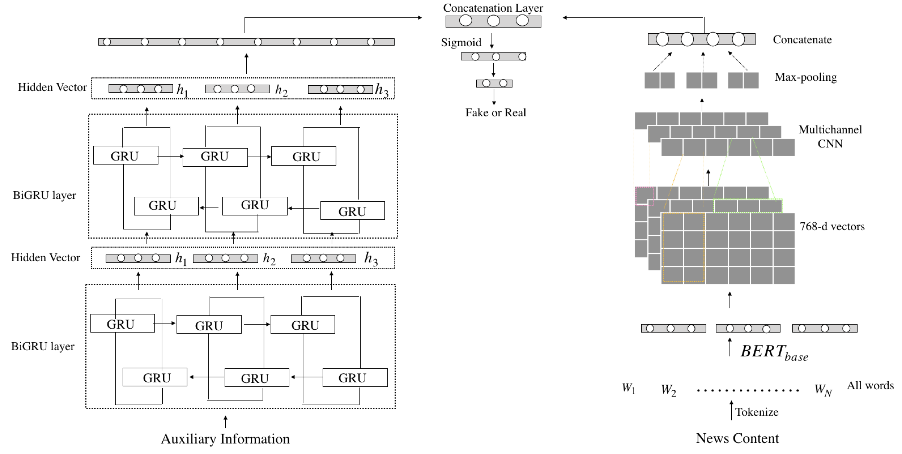

# SBiGRU-MCNN: Fake News Detection

A PyTorch implementation of the hybrid deep learning architecture for fake news detection, based on the paper *"The Power of Context: A Novel Hybrid Context-Aware Fake News Detection Approach"*.

## Architecture



The model combines two parallel branches:

- **BERT + Multichannel CNN (mCNN):** Processes text content (statement + auxiliary information)
- **Stacked BiGRU (sBiGRU):** Processes numerical features (speaker credit history)

Both branches are concatenated and passed through dense layers for binary classification.

## Dataset

**LIAR Dataset** - A benchmark dataset for fake news detection containing ~12K human-labeled statements from PolitiFact.

- **Source:** [Kaggle](https://www.kaggle.com/datasets/msudhan/liar-dataset)
- **Paper:** William Yang Wang, "Liar, Liar Pants on Fire": A New Benchmark Dataset for Fake News Detection, ACL 2017

### Label Mapping (Binary Classification)
- **Real (1):** true, mostly-true, half-true
- **Fake (0):** barely-true, false, pants-fire

## Results

### My Implementation

| Metric | Value |
|--------|-------|
| Accuracy | 0.64 |
| Precision (Real) | 0.66 |
| Recall (Real) | 0.75 |
| F1 (Real) | 0.70 |
| F1 (Fake) | 0.54 |

### Original Paper Results

| Metric | Value |
|--------|-------|
| Accuracy | 0.7451 |
| Precision | 0.7576 |
| Recall | 0.8053 |
| F1 | 0.7807 |

### Gap Analysis

There is approximately a 10-14% gap between the original paper results and this implementation. Possible reasons include:

1. Different text preprocessing approaches
2. Hyperparameter tuning differences
3. Different train/validation split strategies
4. Auxiliary information integration methods

## Requirements

```
torch>=1.9.0
transformers>=4.0.0
pandas
numpy
scikit-learn
matplotlib
seaborn
```

## Usage

### 1. Setup

```bash
# Clone repository
git clone https://github.com/yourusername/sbigru-mcnn-fake-news.git
cd sbigru-mcnn-fake-news

# Install dependencies
pip install -r requirements.txt
```

### 2. Data Preparation

Download LIAR dataset from [Kaggle](https://www.kaggle.com/datasets/msudhan/liar-dataset) and place files in `./data/`:

```
data/
├── train.tsv
├── test.tsv
└── valid.tsv (optional)
```

### 3. Training

Open and run `SBiGRU_MCNN_FakeNewsDetection.ipynb` in Jupyter or Google Colab.

Or modify the configuration section:

```python
# Paths
TRAIN_PATH = './data/train.tsv'
TEST_PATH = './data/test.tsv'
MODEL_SAVE_PATH = './models/sbigru_mcnn.pth'

# Hyperparameters
MAX_LENGTH = 256
BATCH_SIZE = 16
MAX_EPOCHS = 15
LEARNING_RATE = 2e-5
DROPOUT = 0.5
```

## Project Structure

```
.
├── SBiGRU_MCNN_FakeNewsDetection.ipynb  # Main notebook
├── README.md
├── requirements.txt
├── data/
│   ├── train.tsv
│   └── test.tsv
├── models/
│   └── sbigru_mcnn.pth
└── images/
    ├── architecture.png
    ├── confusion_matrix.png
    └── training_curves.png
```

## Model Architecture Details

### Multichannel CNN (mCNN)
- Input: BERT embeddings (768-dim)
- Kernel sizes: [3, 4, 5]
- Filters per kernel: 128
- Output: 384-dim vector

### Stacked BiGRU (sBiGRU)
- Input: 5 numerical features (credit history counts)
- Hidden dimension: 50
- Layers: 2 (bidirectional)
- Output: 100-dim vector

### Classifier
- Combined input: 484-dim (384 + 100)
- Hidden layers: 128 → 64 → 1
- Activation: ReLU + Dropout (0.5)
- Output: Sigmoid

## Training Configuration

- **Optimizer:** AdamW (lr=2e-5, weight_decay=0.01)
- **Loss:** BCEWithLogitsLoss with class weights
- **Scheduler:** ReduceLROnPlateau
- **Early Stopping:** patience=3
- **Gradient Clipping:** max_norm=1.0

## References

1. J. Alghamdi, Y. Lin, and S. Luo, "The Power of Context: A Novel Hybrid Context-Aware Fake News Detection Approach", *Information*, vol. 15, no. 3, p. 122, Feb. 2024. DOI: [10.3390/info15030122](https://doi.org/10.3390/info15030122)
2. W. Y. Wang, "Liar, Liar Pants on Fire": A New Benchmark Dataset for Fake News Detection, *ACL 2017*.
3. J. Devlin, M. W. Chang, K. Lee, and K. Toutanova, "BERT: Pre-training of Deep Bidirectional Transformers for Language Understanding", *NAACL 2019*.

## License

MIT License

## Acknowledgments

- This implementation is for educational purposes
- The original architecture is from the referenced paper
- LIAR dataset is provided by William Yang Wang
